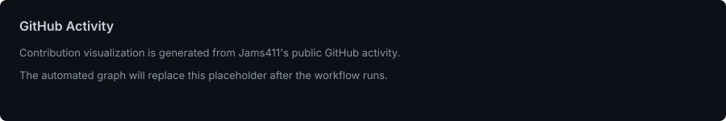

### 🦂

# Jameel Shaikh

**Quantitative Finance · Trading · Technology**

I work at the intersection of markets, quantitative analysis, portfolio management, and technology. My projects focus on building practical, explainable tools for investment research and decision-making.

## Featured Work

### [PortfolioLens](https://github.com/Jams411/portfoliolens)
Multi-asset portfolio research application covering performance and risk analytics, benchmark-relative evaluation, portfolio construction, fixed-income analysis, rebalancing, systematic strategy research, and downloadable reporting.

[Launch PortfolioLens](https://portfolio-lens.streamlit.app/) · [Repository](https://github.com/Jams411/portfoliolens)

### [Portfolio Intelligence Platform](https://github.com/Jams411/portfolio-intelligence-platform)
Long-term quantitative investment research project exploring portfolio modeling, analytics, and investment decision workflows.

### [Trading Journal](https://github.com/Jams411/trading-journal)
A trading-focused project for organizing and reviewing trading activity and research.

## Current Focus

Portfolio analytics · Market risk · Systematic trading · Quantitative research · Financial technology

## Tools

`Python` · `SQL` · `pandas` · `NumPy` · `Plotly` · `Streamlit` · `QuantConnect` · `Git`

## GitHub Activity

---

[LinkedIn](https://www.linkedin.com/in/jams411/) · [PortfolioLens](https://portfolio-lens.streamlit.app/)

